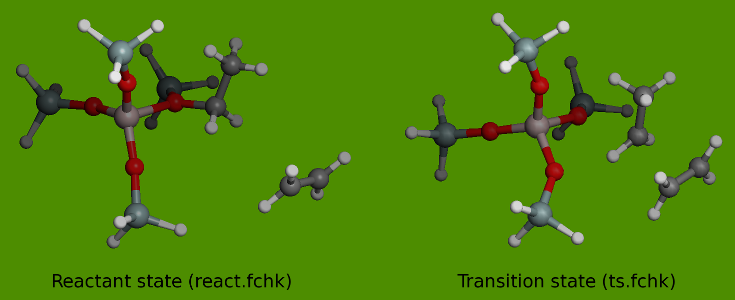

Chemical Physics -- Advanced TAMkin examples
============================================

**TODO**: add introductory text.

Intrinsic rate constants of reactions in zeolites
~~~~~~~~~~~~~~~~~~~~~~~~~~~~~~~~~~~~~~~~~~~~~~~~~

Intrinsic rate constants are typically modeled in a two-step approach where one
first describes the reaction in a small (e.g. 5T) cluster model of the zeolite.
Given the reactant and transition state geometry with the small cluster, one can
construct an initial estimate of the corresponding geometries in a larger
cluster using `Zeobuilder <http://molmod.ugent.be/code/wiki/Zeobuilder>`_. These
structures can be refined with ONIOM or another type of QM/MM computations.

In the example below we study the addition of ethene to an ethyl alkoxide on an
acid site in ZSM-5. The product of this reaction is methylcyclopropane. For the
forward reaction rate no computations on the product state are required.

Small cluster computation (5T)
------------------------------

The reactant and the transition state are depicted in the figures below

The two checkpoint files in the example are derived from frequency computations
with Gaussian03 using the B3LYP/6-31G(d) level of theory at the reactant and
transition state.

File: ``examples/006_5T_ethyl_ethene_addition/reaction.py``

.. literalinclude:: ../../examples/006_5T_ethyl_ethene_addition/reaction.py
   :lines: 37-
   :linenos:

Take note of the following (subtle) choices in the input file:

Line 8:
    The transition state geometry is not perfectly optimized. This would be a
    time-consuming computation and not really required for setting up a draft
    model. The gradient_threshold parameter is increased from ``1e-4`` to
    ``2e-4``.

Line 11-12:
    The translational and rotational contribution can be omitted as these
    reactions take place on a fixed active site in a zeolite catalyst. Free
    rotation and translation of the 5T fragment with the guest molecules is
    not possible. In principle these missing degrees of freedom in the partition
    function should be replaced by a vibrational coupling of the cluster with
    the surrounding framework. This is coupling is essentially neglected in
    a small cluster computation.

Large cluster computation
-------------------------

DIY Kinetic parameter estimation
~~~~~~~~~~~~~~~~~~~~~~~~~~~~~~~~

**TODO**: show how TAMkin can be used to make a powerful ``freqchk``-like
program.

Many similar reactions with a single script
~~~~~~~~~~~~~~~~~~~~~~~~~~~~~~~~~~~~~~~~~~~

**TODO**: explain the for-loop.

Basic kinetics level of theory study
~~~~~~~~~~~~~~~~~~~~~~~~~~~~~~~~~~~~

**TODO**

Smart TAMkin script
~~~~~~~~~~~~~~~~~~~

**TODO**: explain how to write a smart script with TAMkin that detects, based on
a few filename convetions, what type of computation must be carried out.
(Specific for Gaussian.)

Heat of formation
~~~~~~~~~~~~~~~~~

**TODO**: general script for the computation of the heat of formation.

Pattern matching
~~~~~~~~~~~~~~~~

**TODO**: how to use the ``molmod.graphs`` module to locate a set of frozen
atoms in a series of similar systems with unknown atom order.
