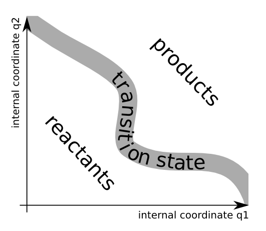
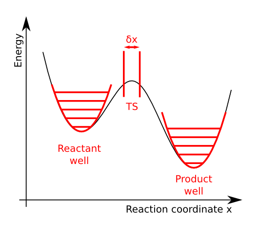

Chemical Physics -- Theoretical Background
==========================================

**TODO**: add some more introductory text.

The partition function of gas-phase molecules
~~~~~~~~~~~~~~~~~~~~~~~~~~~~~~~~~~~~~~~~~~~~~

The classical limit
-------------------

The canonical partition function of a molecular gas in the classical and ideal
gas limit can be written in terms of the partition function of a single gas
molecule:

.. math:: Z_N = \frac{Z_1^N}{N!}.

The subscript :math:`N` and :math:`1` distinguish between the many- and
single-particle partition function. We will also use the notation :math:`Z(N,
\ldots)` and :math:`Z(1, \ldots)`, where the dots stand for the
other boundary conditions (or natural variables) that define the partition
function. This can be volume (:math:`V`) and temperature (:math:`T`), or
pressure (:math:`p`) and temperature (:math:`T`), or yet something else.

The second approximation is the separation of the single-particle partition
function into factors:

.. math:: Z_1 = Z_{1,\text{elec}} Z_{1,\text{trans}} Z_{1,\text{rot}} Z_{1,\text{vib}} \ldots

Only the four most conventional factors are shown here, but an extension with
internal rotors and other contributions is also possible. These factors stand
for:

* :math:`Z_{1,\text{elec}}`: the electronic contribution, i.e. electronic ground
  state energy of the molecule and the multiplicity.
* :math:`Z_{1,\text{trans}}`: the translational contribution, taking into
  account constant volume or constant pressure boundary conditions.
* :math:`Z_{1,\text{rot}}`: the rotational contribution.
* :math:`Z_{1,\text{vib}}`: the vibrational contribution.

All supported contributions in TAMkin will be discussed in detail below. This
separation into factors is an approximation because the corresponding terms in
the molecular Hamiltonian are not completely decoupled. In practice one
constructs a partition function for each subsystem under the assumption that all
other degrees of freedom are in their ground state.

Quantities of interest
----------------------

In the following subsections, the contribution to the following quantities of
each factor in the partition function will be discussed:

.. math::
    :nowrap:

    \begin{align*}
        \mathsf{log} & = \frac{\ln Z_N }{N} \\
        \mathsf{logt} & = \frac{1}{N}\frac{\partial \ln Z_N}{\partial T} \\
        \mathsf{logtt} & = \frac{1}{N}\frac{\partial^2 \ln Z_N}{\partial T^2} \\
        \mathsf{logn} & = \frac{\partial \ln Z_N}{\partial N} \\
        \mathsf{logv} & = \frac{\partial \ln Z_N}{\partial N} - \ln\left(\frac{V}{N}\right)
    \end{align*}

These are all intensive quantities, and we will refer to them in the remainder
of the text as the `basic` quantities. All other thermodynamic functions (free
energy, internal heat, heat capacity, zero-point energy, entropy and chemical
potential) will be derived from the `basic` quantities in a general fashion.

The first step is to rewrite these quantities in terms of the
single-particle partition function, using the classical gas limit and
Stirling's approximation:

.. math::
    :nowrap:

    \begin{align*}
        \mathsf{log} & = \frac{N\ln Z_1 - N\ln N + N}{N} = 1 + \ln\left(\frac{Z_1}{N}\right) \\
        \mathsf{logt} & = \frac{\partial \ln Z_1 }{\partial T} \\
        \mathsf{logtt} & = \frac{\partial^2 \ln Z_1 }{\partial T^2} \\
        \mathsf{logn} & = \frac{\partial [N \ln Z_1 - N\ln N + N]}{\partial N} = \ln\left(\frac{Z_1}{N}\right) + N\frac{\partial \ln Z_1}{\partial N} \\
        \mathsf{logv} & = \ln\left(\frac{Z_1}{N}\right) + N\frac{\partial \ln Z_1}{\partial N} - \ln\left(\frac{V}{N}\right)
    \end{align*}

In these equations, one can fill in the factorization of the single-particle
partition function. We use the following strategy to make sure that the individual
contributions are all intensive quantities.

1. The translational contribution will include all the `effects` of the
   many-body nature of the total partition function.

    .. math::
        :nowrap:

        \begin{align*}
            \mathsf{log}_{\text{trans}} & = 1 + \ln\left(\frac{Z_{1,\text{trans}}}{N}\right) \\
            \mathsf{logt}_{\text{trans}} & = \frac{\partial \ln Z_{1,\text{trans}} }{\partial T} \\
            \mathsf{logtt}_{\text{trans}} & = \frac{\partial^2 \ln Z_{1,\text{trans}} }{\partial T^2} \\
            \mathsf{logn}_{\text{trans}} & = \ln\left(\frac{Z_{1,\text{trans}}}{N}\right) + N\frac{\partial \ln Z_{1,\text{trans}}}{\partial N} \\
            \mathsf{logv}_{\text{trans}} & = \ln\left(\frac{Z_{1,\text{trans}}}{N}\right) + N\frac{\partial \ln Z_{1,\text{trans}}}{\partial N} - \ln\left(\frac{V}{N}\right)
        \end{align*}

2. All other contributions are treated as if they are simple single-particle
   contributions.

    .. math::
        :nowrap:

        \begin{align*}
            \mathsf{log}_{\text{other}} & = \ln Z_{1,\text{other}} \\
            \mathsf{logt}_{\text{other}} & = \frac{\partial \ln Z_{1,\text{other}} }{\partial T} \\
            \mathsf{logtt}_{\text{other}} & = \frac{\partial^2 \ln Z_{1,\text{other}} }{\partial T^2} \\
            \mathsf{logn}_{\text{other}} & = \ln Z_{1,\text{other}} + N\frac{\partial \ln Z_{1,\text{other}}}{\partial N} \\
            \mathsf{logv}_{\text{other}} & = \ln Z_{1,\text{other}} + N\frac{\partial \ln Z_{1,\text{other}}}{\partial N}
        \end{align*}

This strategy has the additional advantage that particles without translational
degrees of freedom can be treated within the same framework. For such systems,
the classical gas limit does not apply either and one has :math:`Z_N = Z_1^N`.
One can simply drop the translational contributions to :math:`\mathsf{log*}`.

Electronic contribution
-----------------------

The electronic states of a molecular system have the typical quantum-mechanical
contribution to the partition function:

.. math:: Z_{1, \text{elec}} = \sum_i g_{i,\text{elec}} \exp\left( - \frac{E_{i,\text{elec}}}{k_B T} \right)

At temperatures below 1000 K, it is in most cases safe to assume that only the
electronic ground state has a signification contribution to the partition
function. TAMkin uses the same reference energy as the electronic structure
computation. Hence we get:

.. math:: Z_{1, \text{elec}} \approx g_{\text{gs}} \exp\left( - \frac{E_{\text{gs}}}{k_B T} \right)

The `basic` quantities become:

.. math::
    :nowrap:

    \begin{align*}
        \mathsf{log}_{\text{elec}} & = \ln(g_{\text{gs}}) - \frac{E_{\text{gs}}}{k_B T} \\
        \mathsf{logt}_{\text{elec}} & = \frac{E_{\text{gs}}}{k_B T^2} \\
        \mathsf{logtt}_{\text{elec}} & = -2\frac{E_{\text{gs}}}{k_B T^3} \\
        \mathsf{logn}_{\text{elec}} & = \mathsf{log}_{\text{elec}}\\
        \mathsf{logv}_{\text{elec}} & = \mathsf{log}_{\text{elec}}
    \end{align*}

Translational contribution
--------------------------

NVT ensemble
^^^^^^^^^^^^

The single-particle translational partition function in the NVT ensemble is
given by:

.. math:: \left(\frac{2\pi m k_B T}{h^2}\right)^{\frac{d}{2}}V

where :math:`d` is the dimension of the gas and :math:`V` is the `generalized`
volume. In three dimensions, :math:`V` is an ordinary volume. In two dimensions,
:math:`V` is a surface area. We prefer not to introduce different symbols for
the `generalized` volume in different dimensions, because it would only clutter
the mathematical derivations.

The `basic` quantities are expressed in terms of only intensive quantities, i.e.
finally :math:`\ln(V/N)` is substituted by :math:`-ln \rho`, where :math:`\rho`
is the particle density. Note that all derivatives are taken at constant volume.

.. math::
    :nowrap:

    \begin{align*}
        \mathsf{log}_{\text{trans,NVT}} & = 1
            + \frac{d}{2}\ln\left(\frac{2\pi m k_B T}{h^2}\right)
            - \ln \rho \\
        \mathsf{logt}_{\text{trans,NVT}} & = \frac{d}{2T} \\
        \mathsf{logtt}_{\text{trans,NVT}} & = -\frac{d}{2T^2} \\
        \mathsf{logn}_{\text{trans,NVT}} & =
            \frac{d}{2}\ln\left(\frac{2\pi m k_B T}{h^2}\right)
            - \ln \rho \\
        \mathsf{logv}_{\text{trans,NVT}} & =
            \frac{d}{2}\ln\left(\frac{2\pi m k_B T}{h^2}\right) \\
    \end{align*}

NpT ensemble
^^^^^^^^^^^^

The many-particle partition function of the NpT ensemble is related to the
partition function of the NVT ensemble as follows [Hill1960]_:

.. math:: Z(N,p,T) = \int_0^{+\infty} Z(N,V,T) \exp\left(-\frac{pV}{k_BT}\right) \frac{p}{k_BT} dV

In the case of a classical ideal gas one can further simplify this relation:

.. math::
    :nowrap:

    \begin{align*}
        Z(N,p,T) & =
            \frac{1}{N!}
            \left(\frac{2 \pi m kT}{h^2}\right)^{\frac{Nd}{2}}
            \int_0^{+\infty}
            V^N \exp\left(-\frac{pV}{k_BT}\right)
            \frac{p}{k_BT} dV \\
                 & =
            \frac{1}{N!}
            \left(\frac{2 \pi m kT}{h^2}\right)^{\frac{Nd}{2}}
            \left( \frac{K_BT}{p} \right)^N
            \int_0^{+\infty} x^N \exp(-x) dx \\
                 & =
            \left(\frac{2 \pi m kT}{h^2}\right)^{\frac{Nd}{2}}
            \left( \frac{V}{N} \right)^N
    \end{align*}

When the logarithm of the partition function is divided by the number of
particles, one obtains a convenient identity for the implementation in TAMkin.

.. math::
    :nowrap:

    \begin{align*}
        \frac{\ln Z(N,p,T)}{N} & =
            \frac{d}{2}\ln\left(\frac{2 \pi m kT}{h^2}\right)
            + \ln\left( \frac{V}{N} \right) \\
                               & =
            \frac{\ln Z(N,V,T)}{N} - 1
    \end{align*}

The `basic` quantities are expressed in terms of only intensive quantities, i.e.
finally :math:`\ln(V/N)` is substituted by :math:`\ln\left( \frac{k_BT}{p}
\right)`. Note that all derivatives are taken at constant pressure

.. math::
    :nowrap:

    \begin{align*}
        \mathsf{log}_{\text{trans}} & =
            \frac{d}{2}\ln\left(\frac{2\pi m k_B T}{h^2}\right)
            + \ln\left( \frac{k_BT}{p} \right) \\
        \mathsf{logt}_{\text{trans}} & = \left(\frac{d}{2} + 1\right)\frac{1}{T} \\
        \mathsf{logtt}_{\text{trans}} & = -\left(\frac{d}{2} + 1\right)\frac{1}{T^2} \\
        \mathsf{logn}_{\text{trans}} & = \mathsf{log}_{\text{trans}} \\
        \mathsf{logv}_{\text{trans}} & =
            \frac{d}{2}\ln\left(\frac{2\pi m k_B T}{h^2}\right) \\
    \end{align*}

Rotational contribution
-----------------------

The rotational temperature, :math:`\Theta_{\text{rot}}`, associated with a
moment of inertia, :math:`I`, is defined as

.. math:: \Theta_{\text{rot}} = \frac{\hbar^2}{2 I k_B}.

We only consider the rotational partition function based on the integration
formula, where one assumes that :math:`\Theta_{\text{rot}}` is much larger than
the temperature of interest.

- For a linear molecule the rotational partition is given by:

  .. math:: Z_{1,\text{rot-lin}} = \frac{T}{\sigma \Theta_{\text{rot}}}

  where :math:`\sigma` is the rotational symmetry number

- For a general non-linear molecule the rotational partition is given by:

  .. math:: Z_{1,\text{rot}} = \frac{\sqrt{\pi}}{\sigma}
                               \sqrt{\frac{T^3}{
                               \Theta_{\text{rot,A}}\Theta_{\text{rot,B}}\Theta_{\text{rot,C}}
                               }}

  where :math:`\sigma` is the rotational symmetry number and `A`, `B` and `C`
  refer to the three principal moments of inertia of the molecule.

One can cast both cases into a single general mathematical expression:

.. math:: Z_{1,\text{rot}} = \frac{1}{\pi\sigma}
                             \prod_{j=1}^M \sqrt{\frac{T\pi}{\Theta_{\text{rot,j}}}}

where the product runs over all non-zero moments of inertia. M is the number of
non-zero moments of inertia. The `basic` quantities become:

.. math::
    :nowrap:

    \begin{align*}
        \mathsf{log}_{\text{rot}} & =
            - \ln(\pi\sigma)
            + \frac{1}{2} \sum_{j=1}^M \ln\left(\frac{T\pi}{\Theta_{\text{rot,j}}}\right) \\
        \mathsf{logt}_{\text{rot}} & = \frac{M}{2T} \\
        \mathsf{logtt}_{\text{rot}} & = -\frac{M}{2T^2} \\
        \mathsf{logn}_{\text{rot}} & = \mathsf{log}_{\text{rot}} \\
        \mathsf{logv}_{\text{rot}} & = \mathsf{log}_{\text{rot}}
    \end{align*}

Vibrational contribution
------------------------

The vibrational partition function is a product of contributions from decoupled
harmonic oscillators. Each factor has the same form. The frequencies required
for the vibrational contribution are typically obtained with a normal mode
analysis on the ground state geometry of a gas phase molecule.

In the case of a transition state geometry, corresponding to a saddle point on
the potential energy surface, one of the frequencies in the normal mode analysis
becomes imaginary. The imaginary frequency is not included in the partition
function, as it would not make any physical sense. At this level, one does not
compensate for this `missing` degree of freedom with some special contribution
to the partition function. It will become clear in the discussion of theoretical
rate constants that this is a practical convention.

Quantum-mechanical form
^^^^^^^^^^^^^^^^^^^^^^^

The partition function of a quantum-mechanical harmonic oscillator is:

.. math:: \frac{\exp\left( -\frac{h \nu}{2k_BT} \right)}{1 - \exp\left( -\frac{h \nu}{k_BT} \right)}

This leads to the following `basic` quantities for a system with N harmonic
oscillators:

.. math::
    :nowrap:

    \begin{align*}
        \mathsf{log}_{\text{qvib}} & = \sum_{i=1}^N -\frac{h\nu_i}{2k_BT}
            - \ln\left[ 1 - \exp\left( -\frac{h \nu_i}{k_B T} \right) \right] \\
        \mathsf{logt}_{\text{qvib}} & =
            \sum_{i=1}^N \frac{h\nu_i}{k_BT^2} \left[
            \frac{1}{2} + \frac{1}{\exp\left( +\frac{h \nu_i}{k_B T} \right)-1}
            \right]
            \\
        \mathsf{logtt}_{\text{qvib}} & =
            \sum_{i=1}^N -\frac{h\nu_i}{k_BT^3} \left[
            1 + \frac{1}{\exp\left( +\frac{h \nu_i}{k_B T} \right)-1}\left(
            2 - \frac{h\nu_i}{k_BT}\frac{1}{1-\exp\left( -\frac{h \nu_i}{k_B T} \right)}
            \right)\right]
            \\
        \mathsf{logn}_{\text{qvib}} & = \mathsf{log}_{\text{qvib}} \\
        \mathsf{logv}_{\text{qvib}} & = \mathsf{log}_{\text{qvib}}
    \end{align*}

These expression look scary, but one can make a few substitutions to facilitate
the implementation:

.. math::
    :nowrap:

    \begin{align*}
        A_i & = \frac{h\nu_i}{k_BT} \\
        B_i & = \exp(-A_i) \\
        C_i & = \frac{B_i}{B_i-1}
    \end{align*}

The `basic` quantities become:

.. math::
    :nowrap:

    \begin{align*}
        \mathsf{log}_{\text{qvib}} & = -\sum_{i=1}^N \frac{A_i}{2} + \ln(1 - B_i) \\
        \mathsf{logt}_{\text{qvib}} & = \sum_{i=1}^N \frac{A_i}{T} \left(\frac{1}{2} + C_i\right) \\
        \mathsf{logtt}_{\text{qvib}} & = -\sum_{i=1}^N \frac{A_i}{T^2} (1 + C_i (2 - A_i / (1 - B_i))) \\
        \mathsf{logn}_{\text{qvib}} & = \mathsf{log}_{\text{qvib}} \\
        \mathsf{logv}_{\text{qvib}} & = \mathsf{log}_{\text{qvib}}
    \end{align*}

In case of frequency scaling factors, i.e. :math:`\alpha_z` for the
frequencies in the zero-point term and :math:`\alpha_f` for the frequencies in
the other term, the implementation is very similar.

.. math::
    :nowrap:

    \begin{align*}
        A_i & = \frac{h\nu_i}{k_BT} \\
        B_i & = \exp(-\alpha_f A_i) \\
        C_i & = \frac{B_i}{B_i-1}
    \end{align*}

The `basic` quantities with correction factors become:

.. math::
    :nowrap:

    \begin{align*}
        \mathsf{log}_{\text{qvib}} & = -\sum_{i=1}^N \frac{A_i\alpha_z}{2} + \ln(1 - B_i) \\
        \mathsf{logt}_{\text{qvib}} & = \sum_{i=1}^N \frac{A_i}{T} \left(\frac{\alpha_z}{2} + C_i\right) \\
        \mathsf{logtt}_{\text{qvib}} & = -\sum_{i=1}^N \frac{A_i}{T^2} (\alpha_z + C_i (2 - \alpha_f A_i / (1 - B_i))) \\
        \mathsf{logn}_{\text{qvib}} & = \mathsf{log}_{\text{qvib}} \\
        \mathsf{logv}_{\text{qvib}} & = \mathsf{log}_{\text{qvib}}
    \end{align*}

Classical form
^^^^^^^^^^^^^^

In the classical limit partition function of the harmonic oscillator reduces to:

.. math:: -\frac{k_BT}{h \nu}

This leads to the following `basic` quantities for a system with N harmonic
oscillators:

.. math::
    :nowrap:

    \begin{align*}
        \mathsf{log}_{\text{cvib}} & = \sum_{i=1}^N \ln\left( \frac{k_BT}{h\nu_i} \right) \\
        \mathsf{logt}_{\text{cvib}} & = \frac{N}{T} \\
        \mathsf{logtt}_{\text{cvib}} & = -\frac{N}{T^2} \\
        \mathsf{logn}_{\text{cvib}} & = \mathsf{log}_{\text{qvib}} \\
        \mathsf{logv}_{\text{cvib}} & = \mathsf{log}_{\text{qvib}}
    \end{align*}

Although the quantum mechanical partition function should give a better
correspondence with experimental results, the classical approximation may still
be of use for comparison with other programs or with molecular dynamics and
Monte Carlo simulations where the nuclei are treated classically.

Rigid free rotor correction
---------------------------

**TODO**

.. math::
    :nowrap:

    \begin{align*}
        \mathsf{log}_{\text{cancel}} & = \\
        \mathsf{logt}_{\text{cancel}} & = \\
        \mathsf{logtt}_{\text{cancel}} & = \\
        \mathsf{logn}_{\text{cancel}} & = \\
        \mathsf{logv}_{\text{cancel}} & =
    \end{align*}

    \begin{align*}
        \mathsf{log}_{\text{frot}} & = \\
        \mathsf{logt}_{\text{frot}} & = \\
        \mathsf{logtt}_{\text{frot}} & = \\
        \mathsf{logn}_{\text{frot}} & = \\
        \mathsf{logv}_{\text{frot}} & =
    \end{align*}

Hindered free rotor correction
------------------------------

**TODO**

.. math::
    :nowrap:

    \begin{align*}
        \mathsf{log}_{\text{hrot}} & = \\
        \mathsf{logt}_{\text{hrot}} & = \\
        \mathsf{logtt}_{\text{hrot}} & = \\
        \mathsf{logn}_{\text{hrot}} & = \\
        \mathsf{logv}_{\text{hrot}} & =
    \end{align*}

Quantities derived from one partition function
~~~~~~~~~~~~~~~~~~~~~~~~~~~~~~~~~~~~~~~~~~~~~~

in this section we shortly review all thermodynamic functions that can be
derived from the `basic` quantities discussed above. The `derived` quantities
are:

========================= =====================
Symbol                    Name
========================= =====================
:math:`F`                 Free energy
:math:`E`                 Internal heat
:math:`C`                 Heat capacity
:math:`E_{\text{ZPE}}`    Zero-point energy
:math:`S`                 Entropy
:math:`\mu`               Chemical potential
========================= =====================

In TAMkin these `derived` thermodynamic functions are implemented in a general
fashion terms of the `basic` quantities. Therefore we will not discuss the
analytical form of each contribution to the a `derived` quantity, as they are
not required for the implementation.

All extensive quantities (all derived quantities except the chemical potential)
are made intensive by dividing through the number of particles.

In all the derivations in the following subsections, the derivatives are taken
such that all natural variables of the ensemble are kept constant, except the
quantity that is derived.

Free energy
-----------

The free energy per particle is defined as

.. math::
    :nowrap:

    \begin{align*}
        \frac{F}{N} & = -k_BT \frac{\ln(Z_N)}{N} \\
                    & = -k_BT \mathsf{(log)}
    \end{align*}

One may wonder how TAMkin makes a distinction between the Gibbs and the
Helmholtz free energy. The convention in TAMkin is that the type of free energy
depends on the ensemble of the partition function. For example, when the
translational partition function corresponds to the NpT ensemble of a 3D gas,
the free energy is the Gibbs free energy. When the translational partition
function corresponds to the NVT ensemble of a 3D gas, the free energy is the
Helmholtz free energy. There are even more sorts of translational contributions
that TAMkin can include in the partition function, or it can even be omitted.
All these options lead to different types sorts of free energies. However, they
all adhere to the definition given above. It is only the form of :math:`Z_N`
that changes.

Internal heat
-------------

The internal heat per particle is defined as

.. math::
    :nowrap:

    \begin{align*}
        \frac{E}{N} & = k_BT^2 \frac{1}{N}\frac{\partial \ln(Z_N)}{\partial T} \\
                    & = k_BT^2 \mathsf{(logt)}
    \end{align*}

When this definition is applied to a partition function of an NVT ensemble of
3D particles, one gets the conventional internal energy. In the case of an NpT
3D gas, this definition leads to the enthalpy. We prefer to use a general name,
`internal heat` instead of internal energy of enthalpy. The physical
interpretation is in both cases the amount of thermal energy that can be
extracted from the system by cooling it down to zero kelvin, and by keeping the
other `natural variables` of the system constant.

Heat capacity
-------------

The heat capacity per particle is the derivative of the internal heat towards
the temperature:

.. math::
    :nowrap:

    \begin{align*}
        \frac{C}{N} & = \frac{1}{N} \frac{\partial E}{\partial T} \\
                    & = 2 k_BT \frac{1}{N}\frac{\partial \ln(Z_N)}{\partial T} +
                        k_B T^2 \frac{1}{N} \frac{\partial^2 \ln(Z_N)}{\partial T^2} \\
                    & = 2 k_BT \mathsf{(logt)} + k_BT^2 \mathsf{(logtt)}
    \end{align*}

This quantity is called the heat capacity at constant volume in the case of an
3D NVT ensemble and the heat capacity at constant pressure in the case of an
3D NpT ensemble.

Entropy
-------

The entropy per particle is defined as:

.. math::
    :nowrap:

    \begin{align*}
        \frac{S}{N} & = \frac{F - E}{NT} \\
                    & = -k_B \frac{\ln Z_N}{N} - k_B T \frac{1}{N} \frac{\partial \ln Z_N}{\partial T} \\
                    & = -k_B (\mathsf{(log)} - T \mathsf{(logt)})
    \end{align*}

The entropy in the chemical context is typically the entropy in the NVT
ensemble.

Chemical potential
------------------

The chemical potential is the derivative of the free energy towards the number
of particles.

.. math::
    :nowrap:

    \begin{align*}
        \mu & = \frac{\partial F}{\partial N} \\
            & = -k_B T \frac{\partial \ln Z_N}{\partial N} \\
            & = -k_B T \mathsf{(logn)}
    \end{align*}

A closer look a the definition of :math:`\mathsf{(logn)}` reveals that the
chemical potential can also be interpreted is the free energy of a single
particle in its `own` volume, i.e. :math:`V/N`. Such a physical interpretation
is convenient, but it may also cause some confusion. Because of this anology,
one can split the chemical potential into an energetic and entropic
contribution:

.. math:: \mu = \frac{E - TS_1}{N}

where :math:`E` is the internal heat per particle and :math:`S_1` is slightly
different from the normal entropy:

.. math::
    :nowrap:

    \begin{align*}
        \frac{S_1}{N} & = \frac{\mu - \frac{E}{N}}{T} \\
                      & = -k_B \frac{\partial \ln Z_N}{\partial N} - k_B T \frac{1}{N} \frac{\partial \ln Z_N}{\partial T} \\
                      & = -k_B (\mathsf{(logn)} - T \mathsf{(logt)})
    \end{align*}

This also reveals that the chemical potential in the limit of the temperature
towards zero is the zero-point energy. The latter is therefore a good
zero'th-order estimate of the chemical potential, which can be used to get
a first insight in the trends in equilibrium constants and rate constants. This
is discussed in more detail below.

Zero-point energy
-----------------

The zero-point energy can be derived in several ways. TAMkin computes it
as the limit of the chemical potential for the temperature going towards zero.
This definition facilitates the comparison with the change in free energy in
a chemical reaction, but it is numerically identical to any other definition. It
is also a computationally beneficial definition.

.. math::
    :nowrap:

    \begin{align*}
        \frac{E_{ZPE}}{N} & = \lim_{T \rightarrow 0} \mu \\
                          & = \lim_{T \rightarrow 0} -kT \mathsf{(logn)}
    \end{align*}

Some remarks:

* TAMkin uses a general scheme for the computation of the zero-point energy that
  can be applied to any contribution in the partition function. The typical
  origin of the zero-point energy correction is the vibrational partition
  function.

* In TAMkin, also the electronic contribution has a zero-piont energy
  because the same reference energy is used as in the electronic structure
  computation.

* Hindered rotors can also have a contribution to the zero-point energy.

Quantities derived from multiple partition functions
~~~~~~~~~~~~~~~~~~~~~~~~~~~~~~~~~~~~~~~~~~~~~~~~~~~~

The equilibrium constant
------------------------

The steady state limit of a chemical reaction is completely characterized by
the equilibrium constant. It is one of the most important quantities that can
be derived from the partition functions in TAMkin.

In the case of ideal gases, this quantity only depends on the temperature, not
on the total pressure. For this reason, it is practically never necessary to set
the pressure in the translational contribution to the partition function.

McQuarrie
^^^^^^^^^

It is instructive to review to the definition of the equilibrium constant given
in `Physical chemistry, a molecular approach`, by McQuarrie and Simon
[McQuarrie1997]_ (page 981). For a chemical reaction of the form

.. math:: \nu_A A(g) + \nu_b B(g) \rightleftharpoons \nu_C C(g) + \nu_D D(g)

the equilibrium constant in terms of concentrations is defined as

.. math:: K_c(T) = \frac{(Z_{1,C}/V)^{\nu_C}(Z_{1,D}/V)^{\nu_D}}
                        {(Z_{1,A}/V)^{\nu_A}(Z_{1,V}/V)^{\nu_B}},

where :math:`Z_{1,X}` is the single-particle partition function of species `X`
and V is the total volume of the system. One can derive the equilibrium constant
in terms of partial pressures using the ideal-gas law:

.. math:: K_p(T) = K_c(T) \left(\frac{c^0k_BT}{p_0}\right)^{\nu_C+\nu_D-\nu_A-\nu_B}.

Although this expressions for :math:`K_c` and :math:`K_p` are perfectly valid, they
are only applicable to the case where all reactants and products are 3D gas phase
particles sitting in the same reactor volume, :math:`V`. TAMkin also supports
partition functions for gases in other dimensions, or even for systems that have
no translational degrees of freedom at all. Moreover, for some applications, one
needs to find the equilibrium between systems that are physically disjunct
instead of sharing the same volume. Therefore we derive a more general
expression in the following section that coincides with the form of McQuarrie in
the case of 3D gases.

General form
^^^^^^^^^^^^

Consider again the same chemical balance,

.. math:: \nu_A A + \nu_b B \rightleftharpoons \nu_C C + \nu_D D,

where we dropped the labels :math:`(g)` as we do no longer consider the
only conventional gas phase systems. An extension with more reactions and
products is trivial. We assume that this reaction takes place in a closed
system, e.g. a reactor vessel, where the number of particles of each species may
only change through the chemical reaction. All possible states in the closed
system are known once we assume a reference state

.. math:: (N^0_A, N^0_B, N^0_C, N^0_D, \ldots).

where :math:`N^0_X` is the reference number of particles of species `X`. The
dots stand for all other natural variables of the closed system, .e.g. total
volume or external pressure, which remain constant during the course of the
reaction.

When we introduce `the extent of reaction`, :math:`\xi`, all other states
reachable through the chemical reaction can be written as

.. math:: (N^0_A - \xi\nu_A, N^0_B - \xi\nu_B, N^0_C + \xi\nu_C, N^0_D + \xi\nu_D, \ldots)

The grand partition function for all states of the mixture is written as:

.. math:: \mathcal{Z} = \sum_{\xi = \xi_{\text{min}}}^{\xi_{\text{max}}}
                Z(N^0_A - \xi\nu_A, N^0_B - \xi\nu_B, N^0_C + \xi\nu_C, N^0_D + \xi\nu_D, \ldots)

where :math:`Z` is the partition function of the mixture at a fixed extent of
the reaction. Assuming that the interactions between particles of different
species can be neglected, the grand partition function becomes:

.. math:: \mathcal{Z} = \sum_{\xi = \xi_{\text{min}}}^{\xi_{\text{max}}}
                Z_A(N^0_A - \xi\nu_A, \ldots)
                Z_B(N^0_B - \xi\nu_B, \ldots)
                Z_C(N^0_C + \xi\nu_C, \ldots)
                Z_D(N^0_D + \xi\nu_D, \ldots)

where :math:`Z_X(N_X, \ldots)` is the partition function of a system with
:math:`N_X` reactants of species `X`. We do not need to know in detail
what kind of partition function :math:`Z_X` represents. It may be an NVT, NpT or
any other ensemble with a fixed number of particles.

The probability of a mixture of reactants and products is proportional to the
product of fixed particle partition functions:

.. math:: p(N_A, N_B, N_C, N_D) \propto Z_A(N_A, \ldots) Z_B(N_B, \ldots) Z_C(N_C, \ldots) Z_D(N_D, \ldots)

where :math:`N_X` is a shorthand for :math:`N^0_{X} + \xi\nu_X`. To find the
most probable state of the system, the chemical equilibrium, we must find `the
equilibrium extent of reqction`, :math:`\xi_{\text{eq}}` that maximizes the
probability :math:`p(N_A, N_B, N_C, N_D)`. Mathematically, this means that we
want to find a non-trivial solution to the equation

.. math:: \frac{\partial p(N_A, N_B, N_C, N_D + \xi_{\text{eq}}\nu_D)}
               {\partial \xi_{\text{eq}}} = 0.

To solve this problem, we rephrase it in terms of free energies, i.e. using
:math:`F_X = -k_Bt\ln(Z_X)` and the fact that the logarithmic function is
monotonous. The most probable state is therefore the state that minimizes the
total free energy.

.. math:: \frac{\partial [F_A(N^0_A - \xi_{\text{eq}}\nu_A, \ldots)
                         +F_B(N^0_B - \xi_{\text{eq}}\nu_B, \ldots)
                         +F_C(N^0_C + \xi_{\text{eq}}\nu_C, \ldots)
                         +F_D(N^0_D + \xi_{\text{eq}}\nu_D, \ldots)]}
               {\partial \xi_{\text{eq}}} = 0

Using the the definition of the chemical potential, :math:`\mu_X(N_X, \ldots) =
\frac{\partial F_X(N_X, \ldots)}{\partial N_X}`, we end up with a very familiar
expression for the equilibrium condition:

.. math:: \nu_C \mu_C(N_{C,\text{eq}}, \ldots) + \nu_D \mu_D(N_{D,\text{eq}}, \ldots)
          - \nu_A \mu_A(N_{A,\text{eq}}, \ldots) - \nu_B \mu_B(N_{B,\text{eq}}, \ldots) = 0

where :math:`N_{X, \text{eq}}` is a shorthand for :math:`N^0_{X} +
\xi_{\text{eq}}\nu_X`. Now we rephrase these equations back in terms of the
partition functions. We rely on the classical gas limit of many-particle
partition function:

.. math::
    :nowrap:

    \begin{align*}
      \mu_X & = -k_BT \left(\frac{\partial \ln(Z_X(N_X, \ldots)}{\partial N_X}\right) \\
            & = -k_BT \left(\frac{\partial \ln\left(\frac{Z^{N_X}_X(1, \ldots)}{N_X!}\right)}{\partial N_X}\right) \\
            & = -k_BT \left(\frac{\partial [N_X\ln(Z_X(1, \ldots)) - N_X\ln(N_X) + N_X]}{\partial N_X}\right) \\
            & = -k_BT \ln\left(\frac{Z_X(1, \ldots)}{N_X}\right)
    \end{align*}

The last step is only valid when :math:`Z_X(1, \ldots)` does not
explicitly depend on the :math:`N_X`, which is only true for ideal gases.

This expression for the chemical potential can be plugged back into the
equilibrium condition to get

.. math:: \frac{N_{C,\text{eq}}^{\nu_C}\,N_{D,\text{eq}}^{\nu_D}}
               {N_{A,\text{eq}}^{\nu_A}\,N_{B,\text{eq}}^{\nu_B}} =
          \frac{Z^{\nu_C}_C(1, \ldots)\,Z^{\nu_D}_D(1, \ldots)}
               {Z^{\nu_A}_A(1, \ldots)\,Z^{\nu_B}_B(1, \ldots)},

which is a standard text-book equation, but now derived in a much more general
context. Now comes the hard part, where we have to keep the derivation general
enough to cover 3D gases, 2D gases, and systems without translational freedom.
In each case we must introduce a definition of a density, which is required for
a general expression of :math:`K_c`:

* **3D gas**: :math:`\rho_X = N_X/V_X`, where :math:`V_X` is the volume of the
  system containing particles of species X.

* **2D gas**: :math:`\rho_X = N_X/A_X`, where :math:`A_X` is the area of the
  system containing particles of species X.

* **Non-translational**: :math:`\rho_X = N_X`, which is simply the occupation
  number of the site X, or the probability that it is occupied. In the classical
  limit, this number is always well below unity.

In analogy, we must introduce different types of `dimensionless auxiliary
partition functions`:

* **3D gas**: :math:`Z'_X(1, \ldots) = Z_X(1, \ldots)/V_X`, where :math:`V_X` is
  the volume of the system containing particles of species X.

* **2D gas**: :math:`Z'_X(1, \ldots) = Z_X(1, \ldots)/A_X`, where :math:`A_X` is
  the area of the system containing particles of species X.

* **Non-translational**: :math:`Z'_X(1, \ldots) = Z_X(1, \ldots)`.

We can finally write down the general form of :math:`K_c`:

.. math:: K_c(T) = \frac{\rho_{C,\text{eq}}^{\nu_C}\,\rho_{D,\text{eq}}^{\nu_D}}
                        {\rho_{A,\text{eq}}^{\nu_A}\,\rho_{B,\text{eq}}^{\nu_B}}
                 = \frac{Z'^{\nu_C}_C(1, \ldots)\,Z'^{\nu_D}_D(1, \ldots)}
                        {Z'^{\nu_A}_A(1, \ldots)\,Z'^{\nu_B}_B(1, \ldots)}

In terms of basic quantities
^^^^^^^^^^^^^^^^^^^^^^^^^^^^

In the case of non-ideal gases, where the gas-particles of different species are
still non-interacting, one can derive a more general the expression for
equilibrium constant. One gets the same final form, except that the logarithm of
the auxiliary partition function must be defined as:

.. math:: \ln Z'_X(N_X, \ldots) = -\frac{\mu_X}{kT} - \ln\left( \frac{V_X}{N} \right)

where V is a generalized volume, e.g. a surface in 2D or a conventional volume
in 3D. In case there is no translational degree of freedom, the last term can
be omitted. In terms of basic quantities, this becomes:

.. math::
    :nowrap:

    \begin{align*}
        \ln Z'_X(N_X, \ldots) & = \mathsf{(logn)}_X - \ln\left( \frac{V_X}{N} \right) \\
                              & = \mathsf{(logv)}_X
    \end{align*}

This can be used to write the logarithm of the equilibrium constant as:

.. math:: \ln K_c(T) = \nu_C \mathsf{(logv)}_C + \nu_D \mathsf{(logv)}_D
                     - \nu_A \mathsf{(logv)}_A - \nu_B \mathsf{(logv)}_B

This form is also suitable for numerical applications because all logarithms are
well-behaved.

The unit of K\ :sub:`c`
^^^^^^^^^^^^^^^^^^^^^^^

By construction :math:`K_c` is no longer a dimensionless quantity. (This is
different from the approach followed by McQuarrie, where :math:`K_c` is made
dimensionless by assuming some reference concentration for each quantity.)
The unit of :math:`K_c` is defined by the partition functions that go into the
equilibrium constant.

- For each gas phase reactant, there is a factor :math:`\text{bohr}^d`, where `d` is
  the dimension of the gas.
- For a each gas phase product, there is a factor :math:`\text{bohr}^{-d}`, where `d` is
  the dimension of the gas.

In SI units, this becomes:

- For each gas phase reactant, there is a factor :math:`m^d\,mol^{-1}`,
  where `d` is the dimension of the gas.
- For a each gas phase product, there is a factor :math:`mol\,m^{-d}`, where
  `d` is the dimension of the gas.

The change in free energy
^^^^^^^^^^^^^^^^^^^^^^^^^

The change in free energy associated with a reaction, :math:`\Delta_r F`, is
defined as the chemical potential of the products minus the chemical potential
of the reactants

.. math:: \Delta_r F = \nu_C \mu_C(N_C, \ldots) + \nu_D \mu_D(N_D, \ldots)
                     - \nu_A \mu_A(N_A, \ldots) - \nu_B \mu_B(N_B, \ldots)

where the chemical potentials are all computed at a certain well-defined state
of the ensemble. For example, for 3D gases, :math:`\Delta_r F` depends on the
pressure and the temperature. When the number is expressed in Hartree/particle,
it is the free energy required to transform :math:`\nu_A` molecules of reactant
A and :math:`\nu_B` molecules of reactant B into :math:`\nu_C` molecules of
product C and :math:`\nu_D` molecules of product B, at a certain reference
state.

Let us now use the relation

.. math:: \mu_X = -k_BT\ln\left(\frac{Z_X(1,\ldots)}{N_X}\right)

to rewrite the change in free energy in terms of partition functions.

.. math:: \Delta_r F = -k_BT \ln\left(
                \frac{Z^{\nu_C}_C(1,\ldots) Z^{\nu_D}_D(1,\ldots)}
                     {Z^{\nu_A}_A(1,\ldots) Z^{\nu_B}_B(1,\ldots)}
                \frac{N^{\nu_A}_A N^{\nu_B}_B}{N^{\nu_C}_C N^{\nu_D}_D}
            \right)

We now assume a reference state for each partition function that leads to a
reference `density`, :math:`\rho_{X,0}`, for each subsystem. The meaning the term
`density` may depend on the dimension of the gas, as discussed previously. We
can further rewrite the change in free energy as:

.. math:: \Delta_r F = -k_BT \ln\left(
                \frac{Z'^{\nu_C}_C(1,\ldots) Z'^{\nu_D}_D(1,\ldots)}
                     {Z'^{\nu_A}_A(1,\ldots) Z'^{\nu_B}_B(1,\ldots)}
                \frac{\rho^{\nu_A}_{A,0} \rho^{\nu_B}_{B,0}}{\rho^{\nu_C}_{C,0} \rho^{\nu_D}_{D,0}}
            \right).

The first factor in the logarithm is the equilibrium constant, so we get:

.. math:: \Delta_r F = -k_BT \ln\left(
                K_c \frac{\rho^{\nu_A}_{A,0} \rho^{\nu_B}_{B,0}}
                         {\rho^{\nu_C}_{C,0} \rho^{\nu_D}_{D,0}}
            \right).

:math:`K_c` is (for ideal gases) independent of the density or pressure of each
component. It still depends on the temperature. The second factor does not
depend on temperature, and bundles all the density or pressure information of
the reference state at which the change in free energy is computed.

One may split the change in free energy into two parts, an energetic and an
entropic contribution:

.. math:: \Delta_r F = \Delta_r E - T \Delta_r S_1

The energetic part is:

.. math:: \Delta_r E = \nu_C E_C(1, \ldots) + \nu_D E_D(1, \ldots)
                     - \nu_A E_A(1, \ldots) - \nu_B E_B(1, \ldots)

where :math:`E_X(1, \ldots)` is the internal heat per molecule of species `X`.

The rate constant -- Transition State Theory
--------------------------------------------

Introduction
^^^^^^^^^^^^

Consider the reaction

.. math:: \nu_A A + \nu_b B \rightarrow P,

where P may a product or a mixture of products. The rate of the reaction is
proportional to some rate constant, :math:`k`, and the concentrations of the
reactants:

.. math:: \frac{d \rho_P}{d T}  = k \rho_A^{\nu_A} \rho_B^{\nu_B}.

Rate constants can be computed with TAMkin using transition state theory. The
derivation below follows the established approach of Eyring, and is based on the
derivation of McQuarrie and Simon (see [McQuarrie1997]_, page 1075). However, we
use slightly different conventions and introduce a few generalizations:

- The derivation below is applicable to any number of reactants.

- We use the same `generalized density`, :math:`\rho_X`, as in the derivation of
  the equilibrium constant. The result is therefore also applicable to surface
  reactions, etc.

- The equilibrium constant is not treated as a dimensionless quantity.

The transition state
^^^^^^^^^^^^^^^^^^^^

The transition state can be seen as a thin border that divides the coordinate
space into the reactant and the product region. The figure below is an
illustration for a two-dimensional system.

The transition state is not some sort of stable intermediate, but rather a
geometrical definition of the molecular configurations that are in between
reactants and products.

Basic equations
^^^^^^^^^^^^^^^

In transition state theory, one assumes there is a quasi-equilibrium between the
reactants and the transition state. The transition state has a certain
probability per unit of time, :math:`f`, to evolve into the product well, for
which there is no reverse process:

.. math:: \nu_A A + \nu_b B \rightleftharpoons T \rightarrow P.

These assumptions can be expressed mathematically as follows:

.. math:: \frac{d \rho_P}{d T}  = f \rho_T

.. math:: \rho_T = K_c^{\ddagger} \rho_A^{\nu_A} \rho_B^{\nu_B}

This leads to a convenient expression for the rate constant:

.. math:: k = f K_c^{\ddagger}

The reaction coordinate
^^^^^^^^^^^^^^^^^^^^^^^

The reaction coordinate is a function of internal coordinates that can be used
to distinguish between reactant and product geometries. It is illustrated in the
figure below:

The potential energy as function of the reaction coordinate has two minima, one
for the reactants and one for the products. Between these wells, the energy
has a local maximum. We assume that the energy as function of all other
coordinates is a simple quasi-harmonic well. This means that the energy maximum
on the reaction coordinate is a saddle point in the full phase space.

Along the reaction coordinate, :math:`x`, we select a small interval that
corresponds to the transition state. In principle one can choose this interval
at any point between the reactant and product well. We make a choice that is
most in line with the assumptions of transition state theory:

- The activated complex falls into the product well as soon as it crosses the
  right boundary of the transition state. For this reason, the right boundary
  should be at the right of the energy maximum.

  When considering the true dynamics of the system, it is still possible that
  the system will bounce back into the reactant well after crossing the right
  boundary without first reaching the product well. These events are neglected
  in transition state theory.

- There is a pseudo-equilibrium between the reactants and the transition state.
  We must therefore put the left boundary at the left of the energy maximum. If
  it would be at the right of the maximum, `all` transition state structures
  would simply fall into the product well.

- As will be discussed below, the width of the transition state region should
  be small such that the potential energy as function of the reaction coordinate
  is nearly constant.

K\ :sub:`c` in terms of gas phase partition functions
^^^^^^^^^^^^^^^^^^^^^^^^^^^^^^^^^^^^^^^^^^^^^^^^^^^^^

The quasi-equilibrium constant, :math:`K_c^{\ddagger}`, can be expressed in
terms of the partition functions of the reactants and the transition state.

.. math:: K_c^{\ddagger}
                = \frac{\rho_{T,\text{eq}}}
                       {\rho_{A,\text{eq}}^{\nu_A}\,\rho_{B,\text{eq}}^{\nu_B}}
                = \frac{Z'_T(1, \ldots)}
                       {Z'^{\nu_A}_A(1, \ldots)\,Z'^{\nu_B}_B(1, \ldots)}

The reactants are treated as simple stable gas-phase molecules, and their
partition functions are straightforward.

The partition function of the transition state needs some special attention. For
all coordinates except the reaction coordinate, one can use the traditional
gas phase approximation to define the partition function. Further one assumes
that the energy dependence on the reaction coordinate can be neglected in the
transition state region. A simple one-dimensional translational partition
function is used for the reaction coordinate.

.. math:: Z'_T(1, \ldots) = Z'_{T,\text{rc}} \times Z'_{T,\text{other}}(1, \ldots)

with

.. math:: Z'_{T,\text{rc}} = \sqrt{ \frac{2\pi m^{\ddagger} k_B T}{h^2} } \delta x

where `rc` stands for reaction coordinate, and :math:`m^{\ddagger}` is the
reduced mass of the reaction coordinate.

The partition function :math:`Z'_{T,\text{other}}(1, \ldots)` is constructed
in the same way as a stable gas phase partition function, but using the saddle
point on the potential energy surface as reference geometry. The imaginary
frequency is not considered in the vibrational contribution to
:math:`Z'_{T,\text{other}}(1, \ldots)`.

A simple model for `f`
^^^^^^^^^^^^^^^^^^^^^^

:math:`f` is the probability per unit of time that a `free` one-dimensional
particle in an NVT system with size :math:`\delta x` crosses the right
boundary of the system. There are two conditions that must be satisfied for the
particle to cross that boundary:

1. The particle must be at the right edge. For a `free` particle in a box with
   length :math:`\delta x`, this happens with a uniform probability density of
   :math:`\frac{1}{\delta x}`.

2. The velocity must be in the right direction.

The flux of particles through the right boundary is computed as the probability
of finding the particle at the right boundary and the average velocity of a
particle when it moves to the right. We use the Maxwell-Boltzmann velocity
distribution to compute the average velocity.

.. math::
    :nowrap:

    \begin{align*}
        f & = \frac{1}{\delta x} \langle v \rangle_\text{right} \\
          & = \frac{1}{\delta x} \int_0^{+\infty} v p(v) dv \\
          & = \frac{1}{\delta x} \sqrt{\frac{m^{\ddagger}}{2\pi k_B T}} \int_0^{+\infty} v
                \exp\left( -\frac{m^{\dagger}v^2}{2 k_B T} \right) dv \\
          & = \frac{1}{\delta x} \sqrt{\frac{k_B T}{2\pi m^{\ddagger}}}
    \end{align*}

Final expression for the rate constant
^^^^^^^^^^^^^^^^^^^^^^^^^^^^^^^^^^^^^^

Putting the results of the previous two subsections together, we get:

.. math::
    :nowrap:

    \begin{align*}
        k(T) & = f(T) K_c^{\ddagger}(T) \\
             & = \frac{1}{\delta x} \sqrt{\frac{k_B T}{2\pi m^{\ddagger}}}
              \sqrt{ \frac{2\pi m^{\ddagger} k_B T}{h^2} } \delta x
              \frac{Z'_{T,\text{other}}(1, \ldots)}{Z'^{\nu_A}_A(1, \ldots)\,Z'^{\nu_B}_B(1, \ldots)} \\
            & = \frac{k_B T}{h}
              \frac{Z'_{T,\text{other}}(1, \ldots)}{Z'^{\nu_A}_A(1, \ldots)\,Z'^{\nu_B}_B(1, \ldots)} \\
            & = \frac{k_B T}{h} \tilde{K}_c^{\ddagger}(T) \\
    \end{align*}

The quantity :math:`\tilde{K}_c^{\ddagger}` is different from the original
equilibrium constant, :math:`K_c^{\ddagger}`. :math:`\tilde{K}_c^{\ddagger}` is
computed with a partition function that does not contain the reaction
coordinate. :math:`K_c^{\ddagger}` is based on a complete partition function
for the transition state.

The change in free energy
^^^^^^^^^^^^^^^^^^^^^^^^^

In analogy to the equilibrium constant in a conventional chemical reaction, one
can also define the change in free energy from the reactants to the transition
state:

.. math:: \Delta^{\ddagger} \tilde{F} = -k_BT \ln\left(
                \tilde{K}_c^{\ddagger}
                \frac{\rho^{\nu_A}_{A,0} \rho^{\nu_B}_{B,0}}{\rho^{\nu_T}_{T,0}}
            \right),

where one must specify reference densities. This is equivalent to

.. math:: \Delta^{\ddagger} \tilde{F} =
                \nu_T \mu_{T,\text{other}}(N_T, \ldots)
                - \nu_A \mu_A(N_A, \ldots) - \nu_B \mu_B(N_B, \ldots),

where :math:`\mu_{T,\text{other}}` is computed with a partition function for the
transition state that does not include the reaction coordinate.

One may split the change in free energy into two parts, an energetic and an
entropic contribution:

.. math:: \Delta_r \tilde{F} = \Delta_r E - T \Delta_r \tilde{S}

The energetic part is:

.. math:: \Delta_r E = E_T(1, \ldots)
                     - \nu_A E_A(1, \ldots) - \nu_B E_B(1, \ldots)

where :math:`E_X(1, \ldots)` is the internal heat per molecule of species `X`.

Kinetic parameters (A and E\ :sub:`a`)
^^^^^^^^^^^^^^^^^^^^^^^^^^^^^^^^^^^^^^

One may rewrite the rate constant as:

.. math:: k(T) = \frac{k_B T}{h}
                 \exp\left( -\frac{\Delta^{\ddagger} \tilde{F}}{k_B T} \right)
                 \frac{\rho^{\nu_T}_{T,0}}{\rho^{\nu_A}_{A,0} \rho^{\nu_B}_{B,0}}

where :math:`\Delta^{\ddagger} \tilde{F}` is computed at the reference densities
in the last factor. The free energy can be split up in an energetic and an
entropic contribution:

.. math:: k(T) = \frac{k_B T}{h}
                 \exp\left( \frac{\Delta^{\ddagger} \tilde{S}_1}{k_B} \right)
                 \frac{\rho^{\nu_T}_{T,0}}{\rho^{\nu_A}_{A,0} \rho^{\nu_B}_{B,0}}
                 \exp\left( -\frac{\Delta^{\ddagger} E}{k_B T} \right)

In a short temperature interval, one may describe the temperature dependence
of the rate constant with the empirical Arrhenius law,

.. math:: k(T) = A \exp\left( -\frac{E_a}{k_B T} \right),

with the kinetic parameters

.. math:: A = \frac{k_B T}{h}
              \exp\left( \frac{\Delta^{\ddagger} \tilde{S}_1}{k_B} \right)
              \frac{\rho^{\nu_T}_{T,0}}{\rho^{\nu_A}_{A,0} \rho^{\nu_B}_{B,0}}

and

.. math:: E_a = \Delta^{\ddagger} E

In this comparison, one assumes that the energy dependence of the expressions
for :math:`A` and :math:`E_a` can be neglected.

However, this does not lead to a convenient computational estimate of the
kinetic parameters. In practice one computes rate constants on a grid in a
well-defined temperature interval, and estimates the kinetic parameters by a
linear regression of :math:`ln(k)` versus :math:`1/T`.

One may double check the estimated activation energy by comparing it with the
change in zero-point energy when going from reactants to the transition state:

.. math:: \Delta^{\ddagger} E_{\text{ZPE}} = \lim_{T \rightarrow 0} \Delta^{\ddagger} E(T)

There should be a good correlation between both numbers because
:math:`\Delta^{\ddagger} E(T)` is only weakly dependent on the temperature.
